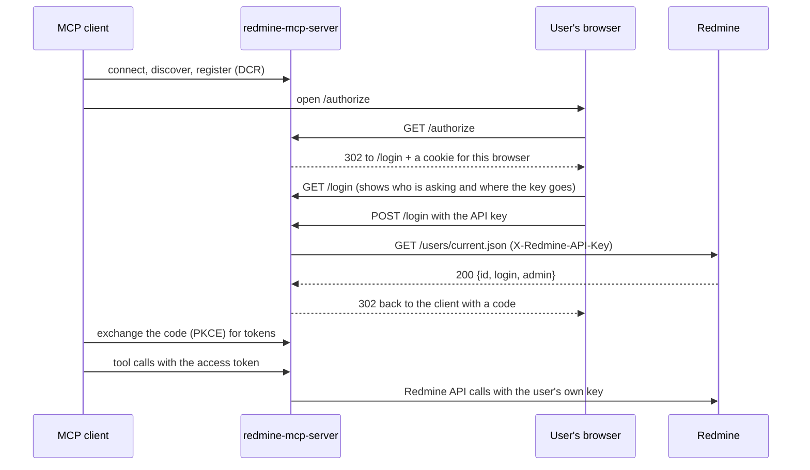

# api-key-login auth mode

## What it is

`REDMINE_AUTH_MODE=api-key-login` gives every user their own Redmine identity on a
Redmine that has no OAuth support: Easy Redmine, and any Redmine older than 6.1.

The server acts as its own OAuth 2.1 authorization server. An MCP client connects to
it the same way it connects to `oauth-proxy`, through discovery, dynamic client
registration, PKCE and refresh tokens. The difference is the browser step. Instead
of logging in to Redmine, the user pastes their personal Redmine API key into a page
served by this server. The server checks the key with one
`GET /users/current.json`, stores it encrypted, and binds it to the tokens it issues.
From then on every tool call runs as that user, under that user's Redmine
permissions.

Nobody configures anything per machine: the client only needs the server URL. The
only credential the server ever sees is an API key, entered once in a browser.
Passwords are never asked for and never accepted.



## When to use it

| Mode | Redmine needs | Identity | Per-machine setup | What OAuth scopes mean |
|---|---|---|---|---|
| `legacy` | any | one shared account | none | no scopes |
| `legacy-per-user` | any | each user | every user sets their key in the client config | no scopes |
| `oauth` | 6.1+ (Doorkeeper) | each user | client config | granted by a Redmine admin and consented per grant |
| `oauth-proxy` | 6.1+ (Doorkeeper) | each user | none (DCR) | granted by a Redmine admin and consented per grant |
| **`api-key-login`** | **any, including Easy Redmine** | **each user** | **none (DCR)** | **a narrowing the client asks for, not Redmine permissions** |

Use `api-key-login` when you distribute one MCP configuration to many people (a
Claude Code plugin, a shared connector) and your Redmine cannot run OAuth. If your
Redmine is 6.1 or newer, prefer `oauth-proxy`: its tokens and scopes come from
Redmine itself, and nobody handles an API key.

## Configuration

Minimal `.env`:

```bash
REDMINE_AUTH_MODE=api-key-login
REDMINE_URL=https://redmine.example.com
REDMINE_MCP_BASE_URL=https://redmine-mcp.example.com   # public https URL of this server
REDMINE_MCP_JWT_SIGNING_KEY=<long random secret>
# Or: REDMINE_MCP_JWT_SIGNING_KEY_FILE=/run/secrets/redmine_mcp_jwt_signing_key
```

| Variable | Default | Notes |
|---|---|---|
| `REDMINE_AUTH_MODE=api-key-login` | `legacy` | activates the mode |
| `REDMINE_URL` | required | the Redmine pasted keys are checked against and used with |
| `REDMINE_MCP_BASE_URL` | required | public URL of this server and the OAuth issuer; must be `https` |
| `REDMINE_MCP_JWT_SIGNING_KEY` | required | the key the store's encryption key is derived from; changing it signs everyone out |
| `FASTMCP_HOME` | `/app/data/fastmcp` in the Docker image | the store lives below `FASTMCP_HOME/api-key-login/`; it must be on a persistent volume |
| `REDMINE_MCP_ALLOWED_CLIENT_REDIRECT_URIS` | loopback only | same allowlist as `oauth-proxy`; see [Security model](#security-model) before changing it |
| `REDMINE_MCP_SCOPES` | all advertised | narrows the scopes the server offers, as in the OAuth modes |
| `REDMINE_OAUTH_SCOPE_ENFORCEMENT` | `on` | per-tool scope checks, as in the OAuth modes |
| `REDMINE_API_KEY_LOGIN_ALLOW_ADMIN` | `false` | accept keys of Redmine administrators; see [Administrator accounts](#administrator-accounts) |
| `REDMINE_API_KEY_LOGIN_ALLOW_HTTP` | `false` | allow an `http://` base URL; local development only |
| `REDMINE_API_KEY_LOGIN_SESSION_DAYS` | `30` | how long a session lasts before the user logs in again; must be positive |
| `REDMINE_API_KEY_LOGIN_RATE_LIMIT` | `300` | login attempts per minute, process-wide safety ceiling |
| `REDMINE_API_KEY_LOGIN_BINDING_CRYPTO` | `server-secret` | `server-secret` or `token-derived`; see [Binding protection](#binding-protection) |

The server refuses to start without `REDMINE_URL`, `REDMINE_MCP_BASE_URL` or the
signing key, with an `http://` base URL (unless the dev flag is set), or with a
session length of zero or less.

No `REDMINE_API_KEY` is used; if one is set it is logged once as ignored. The
settings of the other modes (`REDMINE_INTROSPECT_CLIENT_*`,
`REDMINE_OAUTH_CLIENT_*`, `REDMINE_OAUTH_DISCOVERY_AS`,
`REDMINE_PER_USER_TRUST_PROXY`) are ignored too, and a startup warning names any
that are set.

## Deployment

**HTTPS.** The login page carries an API key, so `REDMINE_MCP_BASE_URL` must be
`https`. As in every mode, the server itself runs as plain HTTP behind your TLS
terminator; firewall its port (default 8000) so users reach it only through the
proxy.

**Persistent store.** Registrations, pending logins, tokens and the encrypted keys
live in a file store below `FASTMCP_HOME/api-key-login/`. The Docker image sets
`FASTMCP_HOME=/app/data/fastmcp`, which `docker-compose` mounts as a volume. Without a
volume every rebuild discards the store and every user has to log in again. The
server logs the resolved directory at startup and warns when `FASTMCP_HOME` is unset.

**Expired records.** The server deletes expired records from that store every
`CLEANUP_INTERVAL_MINUTES` (default 10), starting when it boots. This runs whatever
`AUTO_CLEANUP_ENABLED` says, because `/register` and `/authorize` write to the store
without authentication.

**One replica.** The store is node-local, so a second replica does not see the
sessions of the first. Run a single instance, or pin each client to one instance.

**The signing key.** Changing `REDMINE_MCP_JWT_SIGNING_KEY` starts a new, empty store
(the directory name is derived from the key) and every user logs in again. Keep it
stable and secret.

## Connecting a client

The client needs only the server's MCP URL, `https://redmine-mcp.example.com/mcp`
(`REDMINE_MCP_BASE_URL` plus `FASTMCP_STREAMABLE_HTTP_PATH`, default `/mcp`). No key
goes into any client configuration.

Claude Code:

```bash
claude mcp add --transport http redmine https://redmine-mcp.example.com/mcp
```

VS Code (`.vscode/mcp.json` or the user-profile `mcp.json`):

```json
{
  "servers": {
    "redmine": { "type": "http", "url": "https://redmine-mcp.example.com/mcp" }
  }
}
```

On first use the client opens a browser. The user pastes their key, confirms, and
the browser hands control back to the client. Users find their key in Redmine under
**My account**, in the **API access key** box on the right.

Clients that run on the user's machine and complete the login on a local port
(Claude Code, VS Code, Codex CLI, `mcp-remote`) redirect to a loopback address and
work with the default allowlist. A client that completes the login through a hosted
page redirects to a public URL instead, and that URL has to be added to
`REDMINE_MCP_ALLOWED_CLIENT_REDIRECT_URIS`; its registration otherwise fails with
"redirect_uri ... is not allowed by this server".

## The login page

The page shows, before the user types anything:

- the name the client registered with, and the host the result goes back to;
- the exact Redmine URL the key will be sent to;
- the access the client requested.

It never asks for a password. Tell your users that, and add the page's address to
your phishing-awareness allowlist: a page that asks for a Redmine credential is what
a phishing page looks like too, so users should know which one is real.

A login link is valid for 5 minutes and works only in the browser that the client
opened: the server sets a cookie on that browser when the login starts, and the page
refuses any browser without it. A user who has cookies blocked for this site, or who
copies the link into another browser, sees "This login page was opened in a
different browser, or its cookie was blocked" and has to start again from the client.

Each login allows 3 attempts. A key that is not a Redmine key, or that Redmine
rejects, costs one; if Redmine cannot be reached the page says so and nothing is
charged.

## Scopes in this mode

Scope enforcement works as in the OAuth modes: every tool needs certain scopes, and
`tools/list` shows only the tools the token can use. What the scopes *mean* is
weaker here, and you should know how.

The granted scopes are what the client asked for, limited to what this server
advertises (`REDMINE_MCP_SCOPES`), with `admin` always removed. The user sees them
on the login page and accepts them as a whole. No Redmine administrator configured
them, and they say nothing about the user's Redmine permissions: a token can carry
`edit_issues` for someone who is read-only in every project. Redmine still refuses
anything that user is not allowed to do, so **Redmine's own permissions remain the
boundary**. The scopes only narrow what the agent may attempt.

## Administrator accounts

Keys of Redmine administrators are refused by default: an administrator's key
bypasses Redmine's permission checks, so the per-user boundary would not hold for
that user. The server answers "Keys of Redmine administrators are not accepted
here." and the login has to be started again from the client.

The person setting up the server is often an administrator, so this is usually the
first thing they hit. The better answer is a second, non-administrative Redmine
account for everyday use. If you must allow administrators, set
`REDMINE_API_KEY_LOGIN_ALLOW_ADMIN=true`. Even then a token never carries the
`admin` scope.

With the gate closed, a user who is promoted to administrator after logging in
loses the session at their next token refresh.

## Sessions, signing out and revocation

- **Access tokens** last 1 hour. The client refreshes them on its own.
- **Refresh tokens** rotate on every use. A refresh token that was already used and
  is presented again ends the whole session, because it means a copy is in the
  wrong hands.
- **A session** ends after `REDMINE_API_KEY_LOGIN_SESSION_DAYS` (30 days by default)
  no matter how often it is refreshed; the user then logs in again.
- **Signing out:** a client that revokes its refresh token (RFC 7009 `/revoke`)
  ends the session. Revoking only the access token ends just that token.

**When a key is reset or an account is locked in Redmine,** the session ends, but
not always on the next call. Redmine serves an unknown key as the *anonymous* user
on anything anonymous may read, instead of answering 401. So:

- the first call that reaches a login-only endpoint gets a 401, the tool returns
  "Redmine rejected the API key bound to this session", and the session ends;
- otherwise the next token refresh ends it, because every refresh checks the key
  with Redmine first. That is within an hour.

In between, reads can return the anonymous view. They never run as the original
user: Redmine stops honouring the old key at once. To make the end immediate,
enable **Administration** - **Settings** - **Authentication** - **Authentication
required** in Redmine; with it on, every call with the old key gets a 401.

The refresh check keeps the session when Redmine answers 403 or cannot be reached,
so an outage does not sign everyone out. It ends the session on a 401, on a key
that now belongs to a different user, or on a user who became an administrator
while the gate is closed. **One caution:** a gateway or single-sign-on proxy in
front of Redmine that answers 401 for its own reasons will end every session within
an hour.

**To cut off one user:** reset their API key or lock their account in Redmine. The
MCP server needs no action.

## Binding protection

`REDMINE_API_KEY_LOGIN_BINDING_CRYPTO` decides how the stored API key is protected
at rest. Both schemes encrypt; they differ in who can decrypt.

| | `server-secret` (default) | `token-derived` |
|---|---|---|
| Encrypted with | FastMCP's Fernet wrapper, key derived from `REDMINE_MCP_JWT_SIGNING_KEY` | a random per-binding key, itself encrypted under each token that may need it (HKDF-SHA256, AES-256-GCM) |
| A stolen volume plus the signing key yields | every stored API key | ciphertext |
| A stolen volume alone yields | ciphertext | ciphertext |
| Server-side read of a stored key | possible | impossible without a presented token |
| Code | the framework's, inherits upstream fixes | this repository's |

**How `token-derived` works.** At login the server draws a random data key,
encrypts the binding under it and keeps no copy. That data key is then stored a
second time for each capability that may later need it -- first the authorization
code, then every access and refresh token minted from it -- each time encrypted
under a key derived from that capability's own value. The store holds the *hash* of
a token next to a data key encrypted under the *token*, and the token exists only in
the client's hands. Rotation carries the data key forward to the new pair.

**What it does not protect against.** Root on a live host still harvests keys from
traffic and memory; so does anyone who can read a token. The difference is the blast
radius of a backup, snapshot or disk image: instead of every key of every user who
logged in during the past month, an attacker gets the keys of whoever transacts
while they are watching.

**What it costs, permanently.** Nothing server-side can read a binding without a
token presented to it. That rules out a session admin UI, background revalidation of
stored keys, and re-encrypting bindings when the signing key rotates. The
revalidation at refresh is unaffected: it deliberately runs with the refresh token in
hand. A binding whose tokens have all expired is unreadable and simply ages out.

**Switching an existing deployment.** Records already written under one scheme cannot
be read under the other, in either direction. Nothing is lost and nothing leaks --
every affected session ends at its next call and the user logs in again -- but plan
the change for a moment when that is acceptable, and expect a burst of logins.

## Security model

**What is stored.** The API keys and everything else the server needs to finish
logins and check tokens. Tokens, login links and codes are keyed by their hashes, so
a directory listing yields nothing usable. How the keys themselves are protected
depends on `REDMINE_API_KEY_LOGIN_BINDING_CRYPTO`; see
[Binding protection](#binding-protection). Under the default, **whoever holds both
the store and the signing key can read every stored API key**, including those of
users who have not connected in weeks. Protect the volume, its backups and the
secret accordingly. The server states the guarantee actually in force in a warning
at every startup.

**Who can finish a login.** Only the browser the client opened (see [The login
page](#the-login-page)). The remaining risk is someone who registers their own client
and sends a user a crafted `/authorize` link: the user's browser would then finish a
login for the attacker's client. The redirect allowlist is the guard against this.
With the loopback default, the result goes back to the user's own machine, where
the attacker's client is not running. **Setting
`REDMINE_MCP_ALLOWED_CLIENT_REDIRECT_URIS=*` removes that guard.** Allow only the
redirect URIs of clients you actually use.

**Guessing keys.** Stock Redmine keys are 40 hexadecimal characters, so guessing is
impractical. Each login still allows only 3 attempts, and `POST /login` has a
process-wide ceiling (`REDMINE_API_KEY_LOGIN_RATE_LIMIT`, 300 per minute by default)
that bounds runaway abuse. Because it is shared, a flood above it makes everyone's
logins fail with "Too many login attempts right now" until it stops; the default is
set high so that normal use never reaches it.

**Keys in logs and URLs.** The key travels only in the login form and in the
`X-Redmine-API-Key` header to Redmine. It never appears in a URL or a log line; logs
show a fingerprint (`...` plus the last four characters).

## Relationship to read-only mode

`REDMINE_MCP_READ_ONLY=true` works as in every mode: write tools are blocked and the
server advertises only read scopes, so the login page also asks only for read access.

## Troubleshooting

See the [api-key-login section of the troubleshooting guide](troubleshooting.md#api-key-login).
