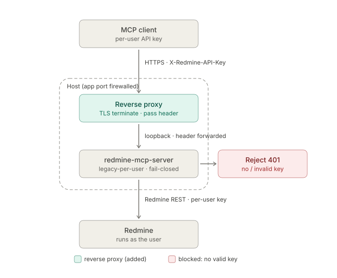

# legacy-per-user auth mode

## What it is

`REDMINE_AUTH_MODE=legacy-per-user` is an opt-in authentication mode for Redmine
instances that are too old to support OAuth (Redmine older than 6.1). In this mode
each user's MCP client stamps every request with that user's own Redmine API key in
an `X-Redmine-API-Key` header. The server reads the key, constructs a per-request
Redmine client, and passes the key straight through to Redmine. Actions appear as the
real user and are subject to that user's permissions.

This is a middle ground between the single-identity `legacy` mode (one shared API key
for all requests) and OAuth2 (not available on older Redmine). It is explicitly opt-in
and fail-closed: the server refuses to start the mode without an operator attestation
flag, and every request without a valid key is immediately rejected.



## When to use it

Use `legacy-per-user` when:

- Your Redmine instance is older than 6.1 and cannot use `oauth` or `oauth-proxy`
  mode.
- You want each user's actions attributed to their own Redmine account.
- You have a reverse proxy in front of this server that terminates TLS.

If your Redmine is 6.1 or newer, prefer `REDMINE_AUTH_MODE=oauth` or
`REDMINE_AUTH_MODE=oauth-proxy`. Per-user OAuth tokens expire, can be scoped, and can
be revoked instantly via Redmine's token management UI. None of these capabilities apply
to API keys.

## Threat model and security requirements

Redmine API keys are unscoped, non-expiring, full-account credentials. If a key leaks
it gives the attacker full impersonation of that user until the key is regenerated.
Before enabling this mode, read and accept all of the constraints below.

### TLS is required end-to-end

This server always runs as plain-HTTP uvicorn behind an operator-controlled TLS
terminator. It cannot enforce TLS itself. The operator attestation flag
`REDMINE_PER_USER_TRUST_PROXY=true` means: "I certify that this server sits behind a
TLS-terminating proxy and that my proxy does not forward a client-supplied
`X-Forwarded-Proto` header."

Without this flag the server refuses to start in `legacy-per-user` mode.

At request time, if the incoming request carries `X-Forwarded-Proto: http`, the
request is rejected immediately as a cheap misconfig catch. This is not a complete TLS
check. The app cannot verify the full transport path, so the attestation flag is
the binding commitment.

### Firewall the app port

The server's HTTP port (default 8000) must not be reachable directly from users or the
internet. Expose only the reverse proxy's TLS port. If a user can reach the uvicorn
HTTP port directly, API keys travel in plaintext.

### Keys in logs

The raw API key is never logged. All log lines use a redacted fingerprint (`...` plus
the last four characters of the key). If you ship server logs to a centralized
aggregator the fingerprint may appear there; the raw key will not. This is the primary
protection that makes a log-leak survivable: even a full log dump does not expose
usable credentials.

### Limited-permission Redmine accounts

Where practical, assign each user a Redmine account with only the roles and
permissions they need. A key tied to a limited account limits blast radius if it is
compromised. Consider a dedicated per-team or per-service account rather than user
accounts with broad project roles.

## Configuration

| Variable | Default | Notes |
|---|---|---|
| `REDMINE_AUTH_MODE=legacy-per-user` | `legacy` | activates the mode |
| `REDMINE_PER_USER_TRUST_PROXY` | `false` | required; operator TLS attestation |
| `REDMINE_PER_USER_AUDIT_IDENTITY` | `false` | opt-in; see Audit section below |

Minimal `.env` for this mode:

```bash
REDMINE_AUTH_MODE=legacy-per-user
REDMINE_URL=https://redmine.example.com
REDMINE_PER_USER_TRUST_PROXY=true
```

No `REDMINE_API_KEY` is used. If one is set it is logged once at startup as ignored.

## Client configuration

Each user's MCP client must stamp `X-Redmine-API-Key: <key>` on every request.
The recommended client is `mcp-remote`:

```json
{ "mcpServers": { "redmine": {
  "command": "npx",
  "args": ["mcp-remote", "https://your-host/mcp",
           "--header", "X-Redmine-API-Key:${RM_KEY}"],
  "env": { "RM_KEY": "<user's redmine api key>" }
}}}
```

Note the colon with no surrounding spaces between the header name and the variable
reference. This avoids an arg-escaping bug in Cursor and Claude Desktop on Windows.

For VS Code, use `.vscode/mcp.json` or the user-profile `mcp.json` with a `headers`
field. The workspace `.mcp.json` silently discards `headers` (microsoft/vscode#319528)
-- do not use that file for this mode.

Any client that cannot set a custom request header, or that reserves the
`Authorization` header for its own OAuth flow, is not compatible with this mode.

## Key validation

Redmine does not answer an unknown or reset API key with 401 everywhere. On any
endpoint anonymous users may read, it serves the request as the anonymous user, so
a mistyped key would quietly return the public view (fewer projects, "no issues")
instead of an error.

To catch that, the server checks each distinct key once with
`GET /users/current.json` (key in the `X-Redmine-API-Key` header, same TLS settings
and `REDMINE_TIMEOUT` as every other Redmine call) and caches the outcome in
memory:

- **Accepted** keys are cached for 5 minutes, so the check costs one extra
  round-trip per user every 5 minutes, not one per request.
- **Rejected** keys (Redmine answers 401) are cached for 60 seconds. The request
  fails with `code: PER_USER_AUTH` and "Redmine did not accept this API key".
- **Anything else** (403 when the REST API is disabled, 5xx, redirects, timeouts,
  connection errors) lets the request through unchanged and is not cached, so a
  Redmine outage is never reported as a wrong key.

The cache holds at most 1024 keys, stored as SHA-256 digests, never the raw key.
It is per process and is lost on restart.

**Known window:** if a key is reset in Redmine while its "accepted" entry is
cached, requests with the old key can still be served as the anonymous user for up
to 5 minutes. They never run as the original user: Redmine stops honouring the
old key immediately.

To remove the anonymous fallback entirely, enable **Administration** -
**Settings** - **Authentication** - **Authentication required** in Redmine. With it
on, Redmine answers an unrecognised key with 401 on every endpoint.

## Audit

By default the server logs a key fingerprint (last four characters) alongside the tool
name on every request. This gives an attributable, redaction-safe trail. The operator
maps fingerprint to human out of band (for example by looking up which user's key ends
in those four characters in Redmine admin).

To log the resolved Redmine user ID instead (one extra round-trip per request):

```bash
REDMINE_PER_USER_AUDIT_IDENTITY=true
```

When set, the server issues `GET /users/current.json` on each request and logs the
Redmine user ID alongside the fingerprint. This adds latency. It is off by default.

## Revocation runbook

The server keeps no key store or denylist. Revocation is delegated entirely to
Redmine: the old key stops acting as the user on the next request. The only local
state is the short-lived validation cache described under
[Key validation](#key-validation).

**To cut off one user:**

1. Log in to Redmine as an administrator.
2. Go to **Administration** - **Users** - select the user.
3. Either:
   - Click **Reset API access key** to generate a new key (the old key stops working
     immediately). Notify the user so they can update their client config.
   - Or click **Lock** to disable the account entirely if the user should no longer
     have any access.
4. No action is needed on the MCP server. Requests with the old key fail with
   "Redmine did not accept this API key" once its validation cache entry expires
   (at most 5 minutes). Until then, reads can return the anonymous view and writes
   fail with 403 (unless "Authentication required" is on, in which case they fail
   right away).

**Lost laptop / departed contractor:** same as above. Regenerate or lock in Redmine;
the MCP server has nothing to flush or restart.

## Relationship to read-only mode

This mode resolves identity only. The read-only guard (`REDMINE_MCP_READ_ONLY=true`)
runs independently. Combining both gives per-user read-only access with no extra
configuration.

## Startup warning

When the server starts in `legacy-per-user` mode it emits a prominent warning:

```
WARNING: legacy-per-user mode active. API keys travel in request headers.
Ensure end-to-end TLS and firewall the app port (default 8000).
```

This is expected and intentional. It is a reminder that the security contract is an
operator commitment, not something the app can enforce structurally.
